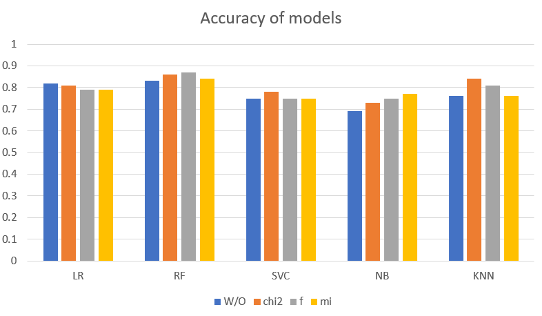
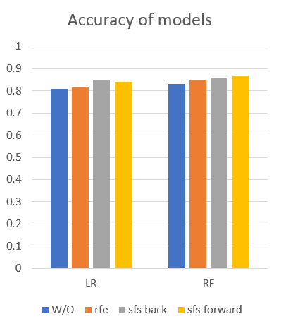

# Disease-Analysis
Analysis of detection of different diseases using differnt features selections techniques e.g., filter method and wrapper method.

# Dataset: 
Parkinson.csv  
Numeber of Samples: 195 
Number of Features: 23 (voice measures) 

# Applied Techniques: 
Classifier: 
• Random Forest 
• Logistic Regression  
• SVC 
• Naive Bayes  
• KNN 

Filter Method:  
• chi2 
• ANOVA F test 
• Mutual Information (MI) 

Wrapper Method:  
• Recursive Feature Elimination 
• Sequential Feature Selector (sfs-forward & sfs-backward) 
• Exhaustive Feature Selector 

# Output: 
Check .csv files for detailed output 

# Performance: 

